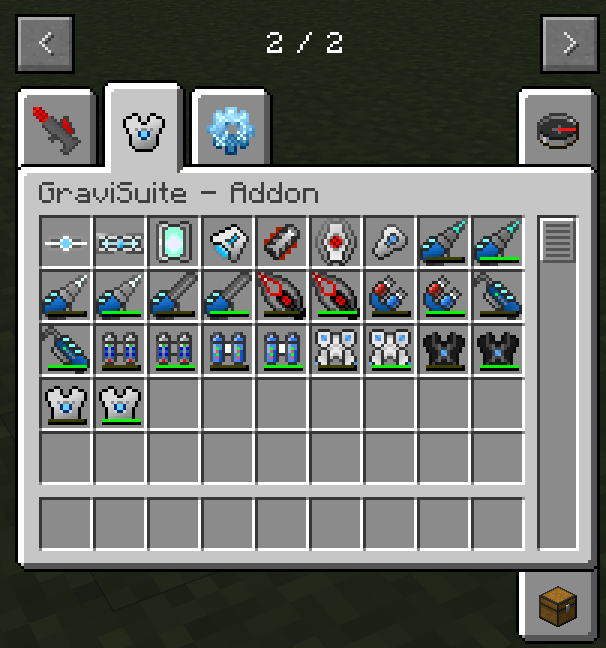

    

# GraviSuite Reforged for Minecraft 1.5.2
 - - - 
This is an attempt to reforge the old-classic IC2 addon - GraviSuite, using [voldeloom](https://github.com/CrackedPolishedBlackstoneBricksMC/voldeloom) as foundation. 

## Armors
 - - -
### Advanced Lappack

As the name states, this is an advanced version of IC2's Lappack.
 - Features: 
   - Energy  provider
 - Specifications:
   - Tier: 3
   - Max Transfer: 1000 EU/t
   - Capacity: 1.000.000 EU/t
 - - - 
### Ultimate Lappack

An ultimate portable energy storage!
 - Features: 
   - Energy provider
 - Specifications:
   - Tier: 3
   - Max Transfer: 50.000 EU/t
   - Max Capacity: 10.000.000 EU
 - - - 
### Advanced Electric Jetpack

An advanced electric jetpack.
- Features: 
  - Energy provider 
  - Flight with hover and boost modes
  - Jetpack Engine can be turned ON/OFF
- Specifications:
    - Tier: 2
    - Max Transfer: 5.000 EU/t
    - Max Capacity: 1.000.000 EU
 - - - - 
### Advanced Nano Chestplate

A hybrid of Advanced Electric Jetpack and IC2's NanoSuit Bodyarmor.
- Features: 
  - Protection provider 
  - Energy provider 
  - Flight with hover and boost modes 
  - Jetpack Engine can be turned ON/OFF
  - Fire extinguisher (uses IC2's Water Cells from inventory)
- Specifications:
    - Tier: 2
    - Max Transfer: 5.000 EU/t
    - Max Capacity: 1.000.000 EU
 - - - - 
### Gravitational Chestplate

ULTIMATE BODYARMOR!
- Features:
    - Protection provider
    - Energy Provider
    - Creative Flight with Anti-Gravity Engine ON, using double-jump
    - Levitation with Levitation mode ON, using jump
    - Fire extinguisher
    - Fall damage absorber
- Specifications:
    - Tier: 3
    - Max Transfer: 50.000 EU/t
    - Max Capacity: 10.000.000 EU

## Tools
 - - -
### Advanced Diamond Drill

An advanced mining tool for IC2
- Features:
    - Mining modes: Normal, Big Holes (3x3x1)
    - Efficiency modes: Normal (160 EU/block @ 35 Efficiency), Low Power (80 EU/block @ 16 Efficiency), Fine (50 EU/block @ 10 Efficiency)
    - Torch Placement on right click
    - Can be enchanted
- Specifications:
    - Tier: 2
    - Max Transfer: 500 EU/t
    - Max Capacity: 45.000 EU
 - - -
### Advanced Iridium Drill

An advanced mining tool MK2 for IC2
- Features:
    - Enchantment modes: Silk Touch, Fortune 3
    - Usage: 1000 EU/block
    - Torch Placement on right click
- Specifications:
    - Tier: 3
    - Max Transfer: 5.000 EU/t
    - Max Capacity: 100.000 EU
 - - -
### Advanced Chainsaw

Improved version if IC2's Chainsaw
- Features:
    - Shears Mode can be turned ON/OFF
- Specifications:
    - Tier: 2
    - Max Transfer: 500 EU/t
    - Max Capacity: 45.000 EU
 - - -
### Vajra

Ultimate Mining Tool!
- Features:
    - Mining modes: Normal, Vein (for ores), Vein Extended (for any block)
    - Efficiency modes: Normal (3200 EU/block @ 128 Efficiency), Low Power (1600 EU/block @ 24 Efficiency), Fine (800 EU/block @ 10 Efficiency)
    - Enchantment modes: Silk Touch, Fortune 3
    - Torch Placement on right click
- Specifications:
    - Tier: 2
    - Max Transfer: 5.000 EU/t
    - Max Capacity: 1.000.000 EU
 - - -
### GraviTool

A 4in1 universal tool  
- Features:
    - 4 Modes: Hoe, TreeTap, Wrench, Screwdriver
    - Usage: 150 EU/use
- Specifications:
    - Tier: 2
    - Max Transfer: 5.000 EU/t
    - Max Capacity: 100.000 EU
 - - -
### Magnet

Very useful helper when mining.
- Features:
    - Works in an 8-16 blocks radius (configurable)
    - Usage: 1 EU/item
- Specifications:
    - Tier: 1
    - Max Transfer: 500 EU/t
    - Max Capacity: 10.000 EU
## Credits
I don't own the idea. Full credit for the idea goes to [SeNtiMeL](https://forum.industrial-craft.net/thread/6915-ic2-exp-1-7-10-gravitation-suite-v2-0-3/) and IC2 Dev team. 